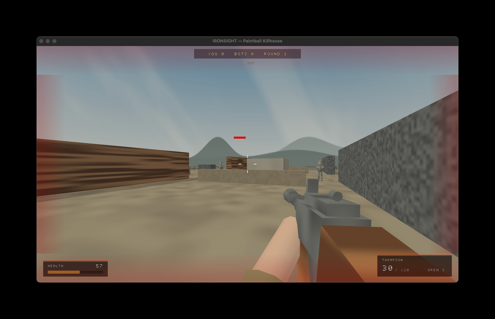

# IRONSIGHT — F# of Duty

IRONSIGHT is an experimental, asset-free WWII first-person shooter written in
F#. Every level, weapon, character mesh, material, font glyph, sound effect, and
particle is generated in code. The same deterministic gameplay core powers the
offline game and an authoritative multiplayer server.

[](https://github.com/HelgeSverre/fsharp-of-duty/actions/workflows/ci.yml)
[](https://github.com/HelgeSverre/fsharp-of-duty/releases/latest)



The project is a playable prototype rather than a finished commercial game. It
is intentionally small, direct, and engine-free: Silk.NET provides the window,
input, OpenGL, and OpenAL layers while ordinary F# records and discriminated
unions model gameplay.

## Highlights

- Fully procedural rendering and audio with no runtime content assets.
- Fixed 60 Hz deterministic simulation with a functional core and imperative
  desktop shell.
- Four arena maps — Paintball Killhouse, Scrap Depot, Canal Yard, and the
  terrain-carved Omaha Draw with slopes, dug trenches, and a wadeable sea.
- Maps are data: a versioned binary `.ironmap` format (spec, not geometry),
  hash-verified map download from servers, and custom maps via
  `IRONSIGHT_LEVEL=/path/map.ironmap` or `--map`.
- Twelve player weapons — Kar98k, M1 Garand, Lee-Enfield, Thompson, STG-44,
  MP40, M1911, Luger P08, Kar98k Sniper, FG42, M1897 Trench Gun, and BAR —
  plus mounted MG42s.
- ADS, sprinting, stances with crouch/prone accuracy bonuses, recoil,
  penetration, grenades, regeneration, blood, headshot gibs, and reload
  feedback.
- Navgraph/A* bot navigation, cover behavior, suppression, and automatic reloads.
- Authoritative 8v8-capable multiplayer with TDM and FFA rooms, prediction,
  interpolation, reconciliation, lag-compensated hits, and reconnect tokens.
- A Half-Life-style server browser fed by a community `servers.json` (edit
  yours in appdata, or PR the repo copy), an in-game loadout picker (`B`),
  and an F3 wireframe/line-of-sight debug view.
- A live public server and project website at
  [fsharp-of-duty.fly.dev](https://fsharp-of-duty.fly.dev/).

## Requirements

- [.NET 10 SDK](https://dotnet.microsoft.com/download/dotnet/10.0). The checked-in
  `global.json` also permits a newer installed SDK.
- An OpenGL 4.1-capable desktop for the graphical client.
- OpenAL support. If audio initialization fails, the game continues silently.
- Optional: [`just`](https://github.com/casey/just), Docker, and `flyctl` for the
  convenience, container, and deployment commands.

The dedicated server is headless and does not require OpenGL or OpenAL.

## Quick start

Download a self-contained build for Windows, macOS, or Linux from the
[latest release](https://github.com/HelgeSverre/fsharp-of-duty/releases/latest) —
no .NET install required. macOS builds are unsigned; run
`xattr -dr com.apple.quarantine Ironsight` after unpacking, or right-click → Open.

Or build from source:

```sh
git clone https://github.com/HelgeSverre/fsharp-of-duty.git
cd fsharp-of-duty
just run
```

Without `just`:

```sh
dotnet restore Ironsight.sln
dotnet run --project src/Ironsight/Ironsight.fsproj
```

Launching without flags opens the menu. Set your callsign, choose Quick Play or
an offline map, or select the official server and an online loadout.

## Common commands

Run `just` to list every recipe.

```sh
just run                         # open the game menu
just training                    # launch the Training Yard dev map directly
just server                      # run a local Paintball server
just server-map omaha            # run a local server with a chosen map
just online-local Player         # connect to the local server
just online Player               # connect to the official TDM server
just ffa Player                  # connect to the official FFA server
just check                       # format check, build, and all tests
just docker-build                # build the headless server image
just fly-validate                # validate fly.toml
just fly-deploy                  # deploy the server
```

Direct online launch supports a callsign, mode, and weapon:

```sh
dotnet run --project src/Ironsight/Ironsight.fsproj -- \
  --online --name Player --weapon "Kar98k Sniper"

dotnet run --project src/Ironsight/Ironsight.fsproj -- \
  --online --ffa --name Player --weapon Thompson
```

Set `IRONSIGHT_SERVER=ws://127.0.0.1:8080/play` to use another server. Set
`IRONSIGHT_LEVEL` on the server to `paintball`, `depot`, `canal`, `omaha`,
`training`, or a path to an `.ironmap` file; clients that lack the map
download it from the server automatically, verified by content hash.
`--map /path/map.ironmap` plays a custom map offline against bots, and
`tools/MapExport.fsx` writes the built-in maps out as reference files.

Press `Y` in an online match to chat. A line starting with `/` is a command,
answered to you alone; `/help` lists the ones you may run. Set `IRONSIGHT_OP_KEY`
on the server and type `/op <key>` to unlock `/say`, `/kick`, `/map`, and
`/restart`. With the variable unset there are no ops at all. See
[docs/MULTIPLAYER.md](docs/MULTIPLAYER.md#chat-and-op-commands).

## Controls

| Input | Action |
| --- | --- |
| `WASD` | Move |
| Mouse | Look |
| Left mouse | Fire |
| Right mouse | Aim down sights (hold; toggle mode in settings) |
| Left Shift | Sprint |
| Space | Jump; crouch mid-air to tuck the legs and clear higher ledges |
| Left Control | Crouch (hold; toggle mode in settings) |
| `Z` | Prone (hold) |
| `R` | Start reload; restart after campaign death |
| `G` | Hold to cook grenade, release to throw |
| `1`–`5` | Weapon category; press again to cycle within it |
| `B` | Open the loadout picker (offline and online) |
| `F3` | Debug view: wireframes, lines of sight, aim rays |
| Tab | Hold the online scoreboard |
| Escape | Pause to the menu; quitting is the explicit QUIT item |

Menus support the mouse or Up/Down and Enter. The callsign editor accepts normal
typing and Backspace. The main menu's SETTINGS entry opens a persisted settings
screen: field of view, contrast, mouse sensitivity, ADS toggle, crouch
toggle, and blood color
saved as JSON under the platform application-data directory (`--reset-settings`
restores defaults).

## Architecture

```text
src/Ironsight.Core/    deterministic simulation, procedural assets, AI, levels
src/Ironsight/         Silk.NET desktop client, renderer, audio, HUD, networking
src/Ironsight.Server/  ASP.NET Core WebSocket server and authoritative matches
tests/Ironsight.Tests/ headless xUnit simulation, client, and server tests
docs/                  current guides plus preserved design specifications
website/               static project site, live leaderboard, and arsenal UI
```

F# compile order enforces the dependency direction. `Ironsight.Core` has no
graphics or server dependency. The client samples input and presents
`GameEvent`s; the server accepts intentions and recomputes movement, weapon state,
hits, damage, and scores.

See [the multiplayer guide](docs/MULTIPLAYER.md) for the current protocol and
deployment model. The [documentation index](docs/README.md) links the original
design and netcode specifications.

## Testing

```sh
just check
```

The suite exercises deterministic generation, movement and collision, weapon
state machines, ballistics, AI/navigation, menus, online reconciliation,
authoritative scoring, grenades, reconnects, and loadout replication. Rendering
still benefits from a manual OpenGL smoke test because CI is headless.

## Running a server

The dedicated server is a headless ASP.NET Core app that listens on
`http://0.0.0.0:8080` by default (override with `PORT`) and hosts the
WebSocket rooms at `/play`, the static website, and the `/api` and `/health`
endpoints.

```sh
just server                      # Paintball Killhouse on port 8080
just server-map omaha            # paintball | depot | canal | omaha | training
```

Without `just`:

```sh
IRONSIGHT_LEVEL=omaha dotnet run --project src/Ironsight.Server/Ironsight.Server.fsproj
```

Or containerized:

```sh
just docker-build
just docker-run                  # maps host 8080 to the container
```

Clients connect with `just online-local Player`, or by setting
`IRONSIGHT_SERVER=ws://127.0.0.1:8080/play` before an `--online` launch. The
server is authoritative: it accepts input intentions and recomputes movement,
weapon state, hits, damage, and scores itself, so gameplay tuning in
`Ironsight.Core` applies to online play without protocol changes.

## Server deployment

The checked-in `Dockerfile` publishes only the headless server. `fly.toml` runs
one 256 MB shared-cpu Machine in Stockholm and checks `/health/ready`. Match and
session state are in memory, so the current deployment intentionally keeps one
Machine running and loses active matches during a rollout.

```sh
just docker-build
just fly-deploy
curl https://fsharp-of-duty.fly.dev/health/ready
```

The public deployment is for development playtests and carries no uptime or data
retention guarantee.

### Add your server to the browser

The in-game server browser merges [`servers.json`](servers.json) from this
repo (fetched live, cached offline) with the copy packaged next to the game
and your own list at `<appdata>/ironsight/servers.json`. To make your server
visible to every player, open a pull request adding one entry:

```json
{ "name": "My Server", "url": "wss://example.com/play" }
```

## Website and public telemetry

The dependency-free files in `website/` can be opened directly or hosted by any
static file server; Fly serves the same directory through the headless server.
The landing page shows the connected players in both live rooms; the arsenal page
loads damage and handling statistics generated from the actual
`Ironsight.Core.Tuning` weapon definitions.

- `GET /api/leaderboard` — live connected players, scores, and selected loadouts
- `GET /api/arsenal` — player and mounted-weapon tuning values
- `GET /maps/{hash}` — the server's current map as a content-addressed
  `.ironmap` download

Leaderboard state is intentionally volatile. It records the active server
process, not accounts or historical rankings, and resets whenever Fly deploys or
restarts the Machine.

## System requirements

Everything is generated in code, so the game is small and light; the one hard
gate is the GPU's OpenGL version. Figures below are measured, not guessed: the
client was profiled in a live bot match (~180 MB RSS, about a third of one
2023 laptop core at 1280x720), the server figures are the actual public
deployment (172 MB RSS, under 2% of a shared vCPU with both rooms ticking),
and the bandwidth numbers come from probing the production server (~10 KB/s
down and ~6 KB/s up per client).

|  | Client (minimum) | Dedicated server (minimum) |
| --- | --- | --- |
| OS | 64-bit Windows 10, macOS 13, or a mainstream glibc Linux | 64-bit Linux (Docker optional); anything that runs .NET 10 |
| CPU | Dual-core x64 or arm64, ~2013 or newer | 1 shared vCPU (the public server's actual size) |
| RAM | 1 GB free (~180 MB measured in game) | 256 MB (172 MB measured with both rooms live) |
| GPU | OpenGL 4.1 core profile: NVIDIA 400 series, AMD HD 5000, Intel Haswell-era, or any Apple silicon | None - headless |
| Disk | ~250 MB (80 MB executable plus caches) | ~200 MB |
| Audio | OpenAL, optional - the game runs silently without it | None |
| Network | Any broadband; ~10 KB/s each way, ping under ~100 ms recommended | Budget ~100 KB/s upstream per player in a full room; ~10-15 Mbps covers all 32 slots |
